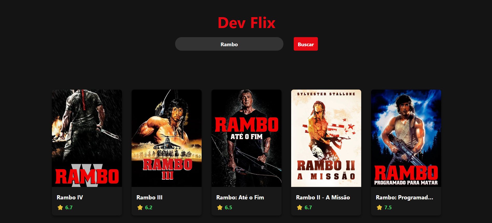
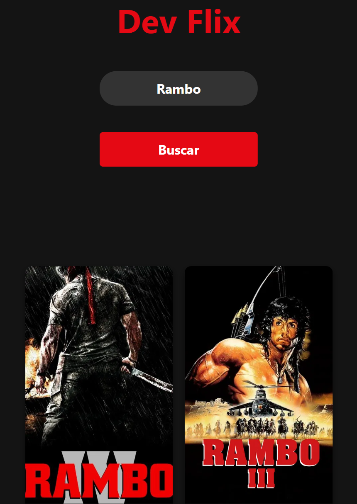

# 🎬 DevFlix - Movie Search App

**DevFlix** is a modern, clean, and fully responsive web application built to search and list movie information in real-time by consuming data from the TMDB (The Movie Database) public API.

The main focus of this project was to apply advanced front-end development concepts using vanilla JavaScript, prioritizing clean, secure, and efficient code architecture.

---

## 📱 Preview

Here is how the application looks on both Desktop and Mobile devices:

<p align="center">
  
  
</p>

---

## 🚀 Features

- **Dynamic Search:** Real-time movie search integrated with the API.
- **Asynchronous API Consumption:** Advanced use of `async/await` and the `Fetch API`.
- **Error Handling:** Immediate validation of server responses using `try/catch` blocks, preventing application crashes.
- **Responsive Interface:** Adaptable layout for mobile devices and desktops using CSS Grid (`auto-fill`, `minmax`) and Flexbox.
- **Security & Performance:** Secure DOM manipulation using `textContent` to avoid XSS vulnerabilities, and script loading optimization with the `defer` attribute inside the `<head>`.

## 🛠️ Technologies Used

- Semantic HTML5.
- Advanced CSS3 (Flexbox, CSS Grid, and Media Queries).
- Vanilla JavaScript (ES6+, Async/Await, Arrow Functions, Template Literals).
- TMDB API for media data fetching.
- [Placehold.co](https://placehold.co/) for handling missing movie posters seamlessly.

## 📦 How to Run the Project Locally

### 1. Clone this repository:

```bash
git clone https://github.com/luisfrancisco2b/movie-search-app
```

### 2. Navigate to the project folder

```bash
cd movie-search-app
```

### 3. 🚀 Running the Project

```bash
Since this is a front-end application, you can run it directly.

Open Open the `index.html` file in your browser, or run it using an extension like **Live Server** in VS Code:

http://127.0.0.1:5500/index.html
```

## 👨‍💻 Author

Luis Francisco
